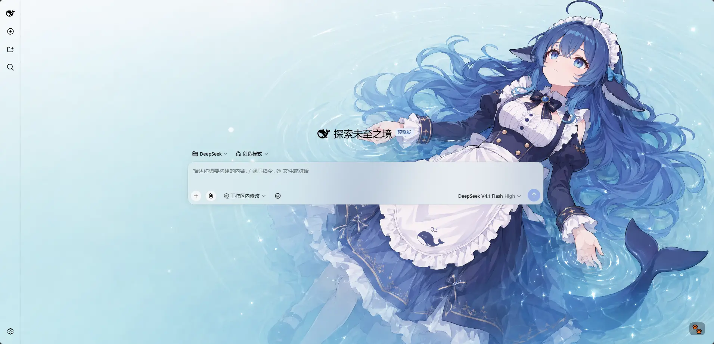
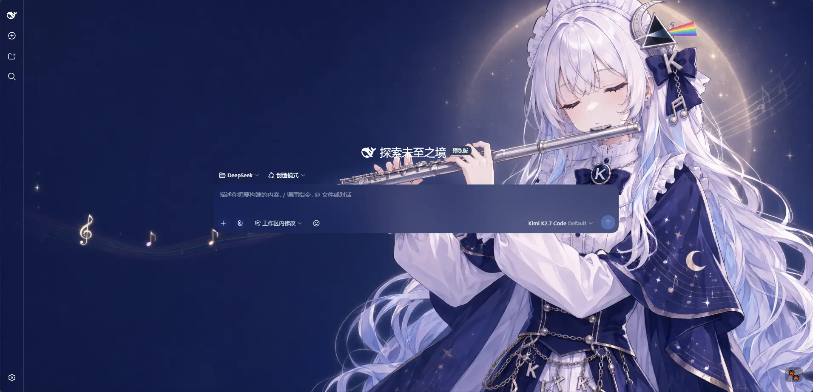
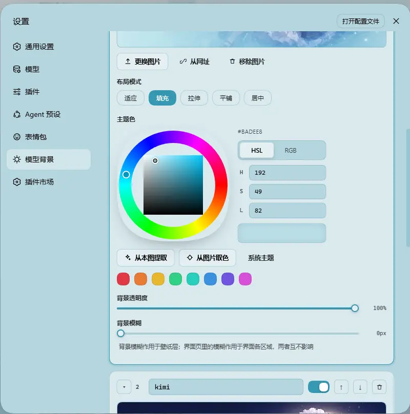

# dsh-background-by-model

<p align="center">
  <a href="https://github.com/HarmlessFunny/dsh-background-by-model"></a>
  <a href="https://www.npmjs.com/package/dsh-background-by-model"></a>
</p>

English | [中文](README.zh.md)

> Forked from [`Tkingxiao/dsh-any-background`](https://github.com/Tkingxiao/dsh-any-background) and renamed to `dsh-background-by-model`.

A **DeepSeek Harness** appearance plugin built around an **ordered list of model rules**. Each rule carries its own wallpaper, theme color, layout mode, framing, opacity and blur — switch the model, and the background switches with it.

> **v0.3.0 is a breaking release.** Video wallpapers, generated dynamic backgrounds and the single global theme color were removed. See the [v0.3.0 entry in CHANGELOG.md](./CHANGELOG.md#v030).

---

## How Model Rules Work

A rule is a **match string** plus **one complete set of background settings**. When you switch models, the plugin reads the current session's model name, scans the list top-down, and applies the **first** rule whose match string appears anywhere in that model name (case-insensitive). If nothing matches, **rule 1** is used — rule 1 doubles as the fallback.

Example list:

| # | Match string | Wallpaper |
| --- | --- | --- |
| 1 | `deepseek` | Image A |
| 2 | `flash` | Image B |
| 3 | `glm` | Image C |

| Current model | Result | Why |
| --- | --- | --- |
| `DeepSeek-Flash` | Rule 1 → Image A | `deepseek` matches first |
| `GLM-Flash` | Rule 2 → Image B | `flash` is earlier in the list than `glm` |
| `Qwen-Flash` | Rule 2 → Image B | `flash` matches |
| `GLM-Turbo` | Rule 3 → Image C | only `glm` matches |
| `Kimi-K3` | Fallback → Rule 1 → Image A | no rule matches |

Notes:

- **Order matters.** The first match wins, not the best match — drag rules to reorder them.
- **An empty match string** makes a rule skip matching entirely and act purely as a fallback. A single rule with an empty match string is therefore "one wallpaper everywhere".
- The match string is compared against the concatenation of **provider, model id and model display name**, so any of the three can be used to select a rule.
- The current model is read from **this session's durable model selection** (the `modelSelection` projection — the same value the composer's model picker renders), so switching the model inside a session takes effect immediately. The Model Background page shows which model was read, and labels it **host default** when only the host-wide default was available instead of this session's own selection.

> Note: the example table above has **no `kimi`** entry, so switching to Kimi falls back to rule 1 = Image A, which looks like "nothing happened". Add a rule with the match string `kimi` to give Kimi its own wallpaper.

## Screenshots

One interface, one config — only the current model differs:

<p align="center">
  
  <br/>
  <em>DeepSeek V4.1 Flash · matched the rule whose match string contains <code>deepseek</code>: a light wallpaper with a matching theme color</em>
</p>

<p align="center">
  
  <br/>
  <em>Kimi K2.7 Code · matched the rule containing <code>kimi</code>: a dark wallpaper, a dark theme, and the whole interface reskinned with it</em>
</p>

<p align="center">
  
  <br/>
  <em>One rule on the Model Background tab · image, layout mode, theme color (wheel / HSL / RGB / extract from this image / pick from image), background opacity and background blur are all properties of that rule alone</em>
</p>

<p align="center">
  <sub>Example wallpaper art from <a href="https://space.bilibili.com/4168597">ZipZipPipe</a> on bilibili</sub>
</p>

## Features

### Model rules

- **Ordered Rule List** — Add, remove, reorder and name rules. Each rule is matched by its own match string; the first hit wins and rule 1 is the fallback.
- **Live Match Readout** — The top of the Model Background tab shows the current state, e.g. `Current model deepseek-flash → matched · Rule 1`, so you can verify a rule on the spot. If the current model can't be detected, a hint is shown instead.
- **Per-rule Appearance** — Every rule owns its wallpaper, theme color, layout mode, framing, opacity and blur. Nothing is shared globally except the Interface tab.
- **Import / Export** — Export every rule **including its wallpaper** to a `dsh-background-by-model-theme.json` (format version 3, images inlined as base64) and restore it anywhere.
- **File-based Persistence** — All settings and images are stored on the filesystem under `~/.dsh/.dsh-background-by-model-data/`, not `localStorage`.
- **Automatic Migration** — Old single-wallpaper configs are upgraded in place on first read. See the [v0.3.0 entry in CHANGELOG.md](./CHANGELOG.md#v030).
- **Bilingual** — Full Chinese / English UI with automatic locale detection.
- **Theme Watchdog** — Re-asserts the custom theme if the host resets it.

### Per-rule settings

- **Wallpaper** — Upload any image as this rule's wallpaper; each rule keeps its own file.
- **Theme Color** — HSL wheel plus numeric input and an inspiration palette, with **Extract from this image** and an **eyedropper**. When a rule sets no theme color, the system theme is used. Generates the full CSS design-token set in real time. Following the system theme hands the palette back to the host while the wallpaper and the Interface-tab opacity/blur sliders keep working — the surface colors are read back from the host's own tokens and re-emitted with your alpha, so the wallpaper is never buried under an opaque plate.
- **Layout Mode** — Fit / Fill / Stretch / Tile / Center.
- **Framing** — Drag to pan and scroll to zoom inside a viewport-proportional editor; **only editable in Fit mode**, and the committed framing stays consistent across window resizes and cross-monitor moves.
- **Background Opacity** — `0–100%` for the rule's wallpaper layer.
- **Background Blur** — `0–60 px`, applied to the wallpaper layer.

### Global settings (Interface tab)

- **Per-part Interface Opacity** — Independent sliders for the main background, left panel, right panel, cards & panels (including the dropdowns and menus around the dialog), the input & controls (composer box, Cordis panel), plus the settings panel and the conversation text box. Independent of the theme color: a rule with no color keeps every one of these sliders live.
- **Per-part Interface Blur** — Frosted-glass `backdrop-filter` blur (`0–60 px`) for each interface part, including a real backdrop on the composer and Cordis panel via stable host selectors.
- **Conversation & Trajectory** — The message list is wrapped in a translucent card automatically, and the trajectory page gets whole-page opacity & blur controls, letting the wallpaper shine through the content.
- **Right Panel** — The column that slides in from the right when you open a file now has a card of its own: its opacity follows **Main background** until you drag it (then this card owns it), and its blur stacks on top of the main-background blur. While closed it takes no space and costs nothing.

## Settings

Settings → **Theme** now has three tabs:

| Tab | Scope | Contents |
| --- | --- | --- |
| **Interface** | Global, shared by every model | Opacity & blur for the main background, left panel, right panel, cards & panels, input & controls, settings panel, conversation text box and trajectory page |
| **Model Background** | Per rule | The ordered rule list, the live match readout, and each rule's wallpaper, theme color, layout mode, framing, opacity and blur |
| **Config** | — | Import / export the whole rule set (`dsh-background-by-model-theme.json`) |

The old **Color** tab is gone — the theme color is now a property of each rule. The old **Background** tab became **Model Background**.

## Storage

Data directory: `~/.dsh/.dsh-background-by-model-data/` (Windows: `C:\Users\<you>\.dsh\.dsh-background-by-model-data\`)

| File | Contents |
| --- | --- |
| `theme-config.json` | The rule list plus the global Interface settings |
| `modelbg-<slot>` | The image of each rule, stored as raw bytes without a file extension |

## Installation

### Method 1: npm install (Recommended)

```sh
dsh plugin --profile web add dsh-background-by-model
# or install straight from the repository:
dsh plugin --profile web add github:HarmlessFunny/dsh-background-by-model
```

Then restart `dsh web`.

The plugin appears as a **"Theme"** section in Settings.

### Method 2: npx (No Global Install)

```sh
npx @deepseek-ai/dsh plugin --profile web add github:HarmlessFunny/dsh-background-by-model
npx @deepseek-ai/dsh web
```

### Method 3: Local Build (Development)

The `lib/` directory is committed, so installs need no build step. To rebuild after editing `src/`:

```sh
git clone https://github.com/HarmlessFunny/dsh-background-by-model.git
cd dsh-background-by-model
pnpm install
pnpm run bundle      # output goes to lib/
pnpm run typecheck
```

To mount a working copy into a profile instead, add it to the profile's `package.json` and register the bundle:

```jsonc
{
  "dependencies": {
    "dsh-background-by-model": "link:E:/DeepSeek/dsh-background-by-model"
  },
  "dsh": {
    "profile": {
      "bundles": ["dsh-background-by-model"]
    }
  }
}
```

After changing anything under `src/`, run `pnpm run bundle` again — the mounted profile loads `lib/`, so edits do not take effect until the bundle is rebuilt.

`pnpm test` builds and typechecks (`tsdown && tsc -p tsconfig.json`).

## FAQ

**Every model looks the same — why?**
Your first rule probably has an empty match string, which makes it a pure fallback holding the whole list. Give rule 1 a match string (or add more specific rules *above* the fallback).

**`GLM-Flash` picked the wrong rule.**
Matching is first-hit, not best-hit. Put the more specific rule higher in the list, or reorder so the rule you want comes first.

**Where are my wallpapers?**
In `~/.dsh/.dsh-background-by-model-data/`, one `modelbg-<slot>` file per rule plus `theme-config.json`.

**Can I share a setup?**
Yes — export it from the **Config** tab; the JSON inlines every rule's image.

**Are video or generated backgrounds supported?**
No. Both were removed in 0.3.0; each rule uses a static image.

**After switching a rule back to "System theme", why is the settings dialog a different palette from the rest of the interface?**
That was a bug, and it is fixed: clearing the color only dropped the `body` token set, while the three **no-host-fallback** redirects inside the dialog (`--dsw-alias-bg-layer-*` → plugin-owned variables), the trajectory view and the AppFrame columns' inline backgrounds all kept the previous color — a dark interface with a light dialog and white-on-white text. Every surface is now driven by a single palette source: the rule's own tokens while it has a color, and the host's own tokens (read back and re-emitted with your alpha) while it follows the system theme, handed back to the host on the way out.

**Why does "Custom color" produce a color the moment I press it?**
Pressing it means leaving the system-theme state, so it has to hand out a starting color. It runs the same **Extract from this image** pass first and only falls back to a default swatch when the image has nothing vivid, so a press no longer jumps from a light interface straight to a dark blue that has nothing to do with the wallpaper.

**After switching back to "System theme" the interface stays light until I drag a slider — why?**
The other half of the same hole: while it owns a color the plugin **forces** `body[data-ds-dark-theme]` (setting its marker for a dark palette, removing the attribute for a light one), and the host only rewrites that flag when it projects a **theme snapshot** — it does not watch the attribute. A flag dropped by a light skin therefore sticks, so the readback captured the host's light palette at the moment the color was cleared and nothing ever re-read it until an unrelated apply ran. Now the switch hands the flag back synchronously in the host's own boolean form, the scheme the host resolved (`ctx.theme`'s `active.colorScheme`, falling back to `html[data-ds-theme-source]` plus `prefers-color-scheme`) is pushed into the render layer, and the one-second watchdog re-reads the host palette while a rule has no color, repainting when it moved.

## Recent Optimizations

> Only the two most recent releases are listed here; older ones (v0.5.0 and earlier) live in [CHANGELOG.md](./CHANGELOG.md).

### v0.5.4

- **A brand-filled control takes its label from the host's on-brand ink, not from `brand-text`** — Following the system theme painted the active layout chip, the **+ Add rule** button and the settings brand tile from the host's own `--dsw-alias-brand-primary`, which is a **contrast ink rather than a hue**: near-black (`#0f1115`) in the host's light scheme, near-white (`#f9fafb`) in its dark one. Their labels read `--dsw-alias-brand-text`, which the host defines as that very same color in both schemes and never uses in its own CSS. On a dark system that made them filled boxes with invisible labels — white primary button, white active chip, white icon tile (measured at exactly `#f9fafb`) — and they were only ever readable while the plugin owned the palette and generated its own brand pair. All four now read `--dsw-alias-label-primary-inverted`, the host's own ink for a brand/contrast fill: `#fff` on the light scheme's black fill, `#353638` on the dark scheme's white one.
- **The toggle's on-state knob was the same bug one size smaller** — a hard-coded `#fff` on a `--dsw-alias-brand-primary` track, i.e. a white knob on the white track the dark scheme paints there.
- **The plugin's own dark palette had the mirror of it** — that branch deliberately keeps its brand fill at 50%+ lightness, while `--dsw-alias-label-primary-foreground` — the token the **host's** own primary buttons label themselves with over `--dsw-alias-button-primary-fill` — was hard-coded white. It now flips with the fill (one shared verdict with `brand-text`), and the light branch re-emits `label-primary-inverted` so the plugin's palette owns the pair instead of inheriting it from whichever scheme the host happens to be in.

### v0.5.3

- **One palette at a time: clearing the theme color no longer leaves the previous skin behind** — The three redirects inside the settings dialog (`--dsw-alias-bg-layer-*` → plugin-owned variables) have **no host fallback**, and neither do the trajectory view's scope or the AppFrame columns' inline backgrounds; all of them were only ever cleaned up at teardown. Switching a rule back to **System theme** therefore left a dark interface with a light dialog and white-on-white text. Every surface is now driven by one palette source: the rule's own tokens while it has a color, and the host's own tokens read back out of the cascade and re-emitted with your alpha when it has none, handed back on the way out. The no-fallback redirects are gated on `html[data-dab-themed]`, so they are only live while the variables they read are actually written.
- **Following the system theme keeps the wallpaper and the Interface sliders** — Clearing the color used to drop the whole token set, and the host's opaque `--dsw-alias-bg-base` then buried the wallpaper while every opacity/blur slider (main background, sidebar, cards, input, settings panel, trajectory view, right panel) silently stopped working. The surfaces are now the host's own colors times your opacity, so the wallpaper keeps showing through.
- **Following the system theme hands the host's dark flag back** — While it owns a color the plugin forces `body[data-ds-dark-theme]` (removing it outright for a light palette), and the host only rewrites that flag when it projects a **theme snapshot** — it does not watch the attribute. A flag dropped by a light skin therefore sticks: the readback captures the host's light palette the moment the color is cleared, and the interface only turned dark once an unrelated slider drag re-ran an apply. The switch now hands the flag back synchronously in the host's own boolean form, using the scheme the host resolved (`ctx.theme`'s `active.colorScheme`, falling back to `html[data-ds-theme-source]` plus `prefers-color-scheme`); the one-second watchdog re-reads the host palette while a rule has no color, and the handback side no longer sits behind the 60 ms skin debounce (which made it read the plugin's own skin on its way out).
- **The no-color button no longer does the opposite of its label** — It read **System theme** while its action was to install a hard-coded dark blue `#1D3463` (the same label means "clear → follow the system theme" one state over). It is now **Custom color**, and it runs the *Extract from this image* pass first, falling back to the seed swatch only when the image has nothing vivid.
- **The token fingerprint is only recorded after the stylesheet write succeeds**, so a failed write is retried instead of pinning the interface to the old palette until another key happens to change.
- **Fixed the mojibake dash in the `package.json` description**, which is what the npm page shows.

## Star History

[](https://www.star-history.com/?repos=HarmlessFunny%2Fdsh-background-by-model&type=timeline&legend=bottom-right)

## License

MIT
