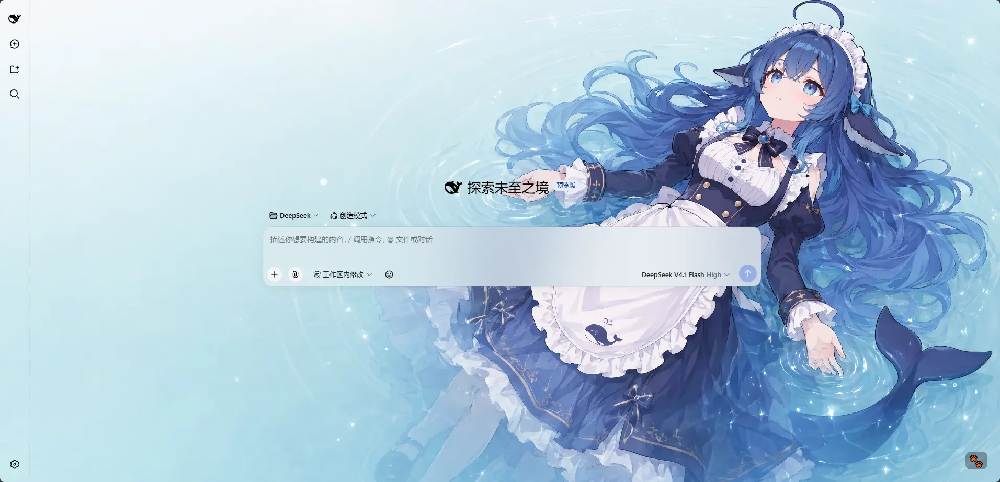
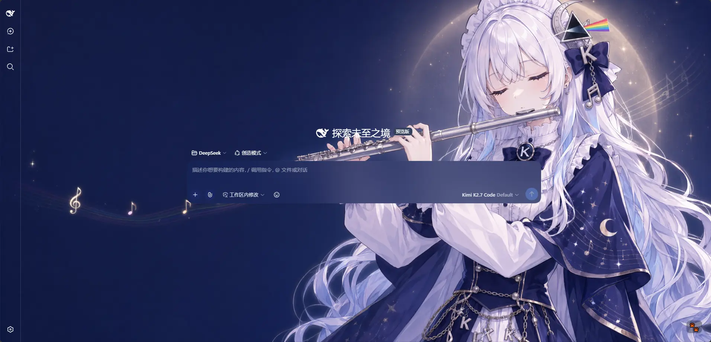
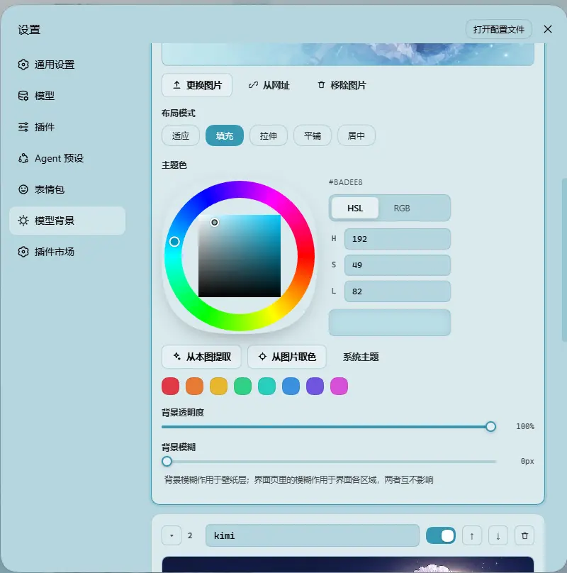

# dsh-background-by-model

<p align="center">
  <a href="https://github.com/HarmlessFunny/dsh-background-by-model"></a>
  <a href="https://www.npmjs.com/package/dsh-background-by-model"></a>
</p>

[English](README.md) | 中文

> 派生自 [`Tkingxiao/dsh-any-background`](https://github.com/Tkingxiao/dsh-any-background)，并重命名为 `dsh-background-by-model`。

一个 **DeepSeek Harness** 外观插件，核心是一份**有序的模型规则列表**：每条规则自带壁纸、主题色、布局模式、取景、透明度与模糊度，切换模型即切换背景。

> **v0.3.0 是破坏性更新**：视频背景、生成式背景与全局主题色均已被移除。详见[从 0.2.x 升级](#从-02x-升级)。

---

## 模型规则如何工作

一条规则 = 一个**匹配串** + **一整套背景外观**。切换模型时，插件读取当前会话的模型名，自上而下扫描列表，使用**第一条**“匹配串出现在模型名里”的规则（忽略大小写）。如果一条都没命中，就使用**第 1 条**——规则 1 同时兼任兜底。

示例列表：

| # | 匹配串 | 背景图 |
| --- | --- | --- |
| 1 | `deepseek` | 图 1 |
| 2 | `flash` | 图 2 |
| 3 | `glm` | 图 3 |

| 当前模型 | 结果 | 原因 |
| --- | --- | --- |
| `DeepSeek-Flash` | 规则 1 → 图 1 | `deepseek` 先命中 |
| `GLM-Flash` | 规则 2 → 图 2 | `flash` 比 `glm` 更靠前 |
| `Qwen-Flash` | 规则 2 → 图 2 | `flash` 命中 |
| `GLM-Turbo` | 规则 3 → 图 3 | 只有 `glm` 命中 |
| `Kimi-K3` | 兜底 → 规则 1 → 图 1 | 都没有命中 |

说明：

- **顺序即优先级。** 先命中者胜，而不是最精确者胜——需要时拖动规则调整顺序。
- **匹配串留空**表示该规则不参与匹配、只作为兜底。因此单规则 + 空匹配串就是“一张图到处用”。
- 匹配串会同时比对 **provider、模型 id 与模型显示名**三者拼接出的字符串，三者任一都能用来选中规则。
- 当前模型取自**本会话的持久化模型选择**（`modelSelection` 投影，和输入框上的模型选择器读的是同一份值），因此会话内切换模型会立即生效。「模型背景」页顶部会显示当前读到的是哪个模型；如果只读到宿主全局默认模型（不是本会话的选择），会额外标注 **宿主默认**。

> 提醒：上面这张示例表里**没有 `kimi`**，所以切到 Kimi 会走到兜底 = 规则 1 = 图 1，看起来像“没反应”。想给 Kimi 单独配图，就加一条匹配串为 `kimi` 的规则。

## 截图

同一套界面、同一份配置，只因为当前模型不同：

<p align="center">
  
  <br/>
  <em>DeepSeek V4.1 Flash · 命中匹配串含 <code>deepseek</code> 的规则：浅色壁纸 + 与图相配的主题色</em>
</p>

<p align="center">
  
  <br/>
  <em>Kimi K2.7 Code · 命中匹配串含 <code>kimi</code> 的规则：深色壁纸 + 深色主题，整个界面跟着换肤</em>
</p>

<p align="center">
  
  <br/>
  <em>「模型背景」页的单条规则 · 图片、布局模式、主题色（色轮 / HSL / RGB / 从本图提取 / 从图片取色）、背景透明度与背景模糊度，都是这一条规则自己的属性</em>
</p>

<p align="center">
  <sub>示例壁纸素材来源于 bilibili <a href="https://space.bilibili.com/4168597">ZipZipPipe</a></sub>
</p>

## 功能特性

### 模型规则

- **有序规则列表** — 可新增、删除、拖动排序并命名规则；每条规则用自己的匹配串参与匹配，先命中者生效，规则 1 兼任兜底。
- **实时状态提示** — 「模型背景」页顶部会显示当前状态，例如「当前模型 deepseek-flash → 命中 · 规则 1」，方便当场验证规则写对没有；检测不到当前模型时会给出提示。
- **外观随规则走** — 壁纸、主题色、布局模式、取景、透明度与模糊度都是每条规则自己的属性；除「界面」页外没有任何全局外观项。
- **导入 / 导出** — 一键把**每一条规则连同它的图片**导出为 `dsh-background-by-model-theme.json`（版本 3，图片以 base64 内联），可随时导入还原。
- **文件持久化** — 所有设置与图片保存到文件系统 `~/.dsh/.dsh-background-by-model-data/`，不依赖 `localStorage`。
- **自动迁移** — 旧版单壁纸配置在首次读取时自动升级，详见[从 0.2.x 升级](#从-02x-升级)。
- **中英双语** — 完整的中英文界面，自动跟随语言设置。
- **主题守护** — 宿主重置主题后自动重新激活自定义主题。

### 每条规则自带的外观

- **背景图片** — 上传任意图片作为该规则的壁纸，每条规则一张独立图片文件。
- **主题色** — HSL 色轮 + 数值输入 + 灵感色板，支持「从本图提取」与吸管「从图片取色」；不设主题色时跟随系统主题。实时生成整套 CSS 设计令牌。
- **布局模式** — 适应 / 填充 / 拉伸 / 平铺 / 居中。
- **取景** — 在视口比例的编辑器中拖动平移、滚轮缩放；**仅「适应」模式下可编辑**，提交的构图在窗口缩放、跨屏移动后保持一致。
- **背景透明度** — `0–100%`，作用于该规则的壁纸层。
- **背景模糊** — `0–60 px`，作用于壁纸层。

### 全局设置（「界面」页）

- **分部位界面透明度** — 主背景、侧边栏、文件预览侧栏、卡片面板（含对话框周围的选项框/菜单）、输入框与控件（发送框、Cordis 插件面板）、设置面板与对话文本框各自独立滑块。
- **分部位界面模糊度** — 每个界面部位可独立调整毛玻璃 `backdrop-filter` 模糊（`0–60 px`），并通过宿主的稳定选择器为发送框与 Cordis 面板提供真实背景模糊。
- **对话与轨迹页** — 消息列表自动包裹为半透明卡片，轨迹页可整页调节透明度与模糊，让壁纸从内容后方透出来。
- **文件预览侧栏** — 点开文件后从右侧滑出的那一栏有了自己的卡片：透明度默认跟随「主背景」（拖动后本卡片接管），模糊则在主背景模糊之上再叠加；关闭时不占位置、无副作用。

## 设置界面

设置的 **「主题」** 分类下现在有三个选项卡：

| 选项卡 | 作用范围 | 内容 |
| --- | --- | --- |
| **界面** | 全局，所有模型共用 | 主背景、侧边栏、文件预览侧栏、卡片面板、输入框与控件、设置面板、对话文本框、轨迹页的透明度与模糊度 |
| **模型背景** | 每条规则 | 有序规则列表、顶部实时状态，以及每条规则的壁纸、主题色、布局模式、取景、透明度与模糊度 |
| **配置** | — | 导入 / 导出整套规则（`dsh-background-by-model-theme.json`） |

原先的 **「色彩」** 选项卡已删除——主题色改为每条规则自己的属性；原 **「背景」** 选项卡已改造成 **「模型背景」**。

## 存储位置与迁移

数据目录：`~/.dsh/.dsh-background-by-model-data/`（Windows：`C:\Users\<你>\.dsh\.dsh-background-by-model-data\`）

| 文件 | 内容 |
| --- | --- |
| `theme-config.json` | 规则列表 + 全局「界面」设置 |
| `modelbg-<slot>` | 每条规则的图片，保存为原始字节，无扩展名 |

### 从 0.2.x 升级

v0.3.0 **移除**了三项功能：

- **视频背景** — 不再支持。
- **生成式背景** — 网格渐变（mesh）、Shader、几何图案（pattern）均已移除。
- **全局主题色** — 改为每条规则自带。

除此之外升级是自动且无损的：首次读取时，如果发现旧格式配置（没有 `rules` 数组），插件会把旧的单张 `wallpaper.jpg` 变成**规则 1**，匹配串留空（即纯兜底），并继承旧的主题色、布局模式、透明度、模糊与取景；同时清理旧版遗留的视频文件。老用户升级后外观保持不变——只有想按模型区分背景时，才需要自己再加规则。

## 安装

### 方式一：npm 安装（推荐）

```sh
dsh plugin --profile web add dsh-background-by-model
# 或者直接从仓库安装：
dsh plugin --profile web add github:HarmlessFunny/dsh-background-by-model
```

装完需要重启 `dsh web`。

插件会出现在设置面板的 **“主题”** 分类中。

### 方式二：npx（无需全局安装）

```sh
npx @deepseek-ai/dsh plugin --profile web add github:HarmlessFunny/dsh-background-by-model
npx @deepseek-ai/dsh web
```

### 方式三：本地构建（开发）

`lib/` 目录已提交，安装后无需构建。修改 `src/` 后重新构建：

```sh
git clone https://github.com/HarmlessFunny/dsh-background-by-model.git
cd dsh-background-by-model
pnpm install
pnpm run bundle      # 产物在 lib/
pnpm run typecheck
```

本地开发挂载方式：在 profile 的 `package.json` 里加 `link:` 依赖并把它加进 `dsh.profile.bundles`：

```jsonc
{
  "dependencies": {
    "dsh-background-by-model": "link:E:/DeepSeek/dsh-background-by-model"
  },
  "dsh": {
    "profile": {
      "bundles": ["dsh-background-by-model"]
    }
  }
}
```

改完 `src/` 必须重新执行 `pnpm run bundle` 才会生效——挂载的 profile 加载的是 `lib/`。

## 兼容性

- **[`dsh web`](https://github.com/deepseek-ai/deepseek-harness)** — 同时兼容 npm 发布版与新版源码构建。插件会自动检测宿主携带的客户端模块表（新版 `@deepseek-ai/dsh-client-store` 或旧版 `@deepseek-ai/dsh-client-runtime`），并在运行时据此解析 `defineStore`。
- **[deepseek-harness-desktop](https://github.com/anywhere-labs/deepseek-harness-desktop)** — 支持

## 常见问题

**所有模型看起来都一样，为什么？**
多半是第 1 条规则的匹配串是空的，它成了纯兜底、把整个列表兜住了。给规则 1 填一个匹配串，或把更具体的规则加到兜底规则**上面**。

**`GLM-Flash` 命中了不是我想用的规则。**
匹配是先命中者胜，而不是最精确者胜。把更具体的规则往上拖，或调整顺序让你想要的规则排在前面。

**图片存在哪？**
在 `~/.dsh/.dsh-background-by-model-data/`：每条规则一个 `modelbg-<slot>` 文件，外加 `theme-config.json`。

**能分享整套配置吗？**
可以，在 **「配置」** 页导出即可；导出的 JSON 会把每条规则的图片内联进去。

**支持视频或生成式背景吗？**
不支持。两者都在 0.3.0 中移除，每条规则使用一张静态图片。

## 近期优化

### v0.3.2

- **「文件预览侧栏」卡片** — 点开文件后从右侧滑出的那一栏现在有自己的透明度与模糊度滑块。它此前的唯一表面就是 `--dsw-alias-bg-base`，也就是「主背景」滑块改写的那个令牌，所以它一直是主背景的第二份拷贝、无法单独调节。新卡片的透明度**默认跟随「主背景」**（首次拖动后才由自己接管），因此升级后外观零变化；模糊则叠加在主背景模糊之上。面板关闭时只是滑出屏幕，这张卡片不会带来任何副作用。
- **宿主侧配置保留新字段** — `theme-config.json` 新增 `rightbarOpacity` 与 `blurs.rightbar`；缺字段（旧配置）一律按「跟随主背景」处理，导入旧配置文件同样如此。

### v0.3.1

- **文档与截图更新** — 截图换成当前的三选项卡界面：同一份配置在 DeepSeek 与 Kimi 下的两种外观，外加单条规则的编辑器。旧的七张图（还带着已删除的「色彩」选项卡与旧「背景」页）已删除，图片体积从 3.6 MB 降到 220 KB。
- **npm 包内附截图** — `example_img/` 现在包含在发布包里，npm 页面上的 README 不再有裂图。
- **素材致谢** — 示例壁纸素材来源于 bilibili [ZipZipPipe](https://space.bilibili.com/4168597)。

### v0.3.0

- **模型规则取代单张全局壁纸** — 背景改由有序规则列表驱动，每条规则用匹配串比对当前会话的模型名来选中（先命中者胜，规则 1 兜底）；匹配串会同时比对 provider、模型 id 与显示名三者。
- **外观从全局下放到每条规则** — 壁纸、主题色、布局模式、取景、背景透明度与背景模糊都成为规则自身的属性，不同模型可以有完全不同的外观。
- **设置选项卡重构** — 现在是 **「界面」**（全局）、**「模型背景」**（规则列表）与 **「配置」**（导入/导出）；**「色彩」** 选项卡随全局主题色一并删除，原 **「背景」** 选项卡改造成 **「模型背景」**。
- **实时状态提示** — 「模型背景」页会显示当前模型及其命中的规则（例如「当前模型 deepseek-flash → 命中 · 规则 1」），检测不到时给出提示。
- **导出格式 v3** — `dsh-background-by-model-theme.json` 现在包含全部规则配置**以及**每条规则的图片（base64 内联）。
- **破坏性移除** — 视频背景、生成式背景（网格渐变 / Shader / 几何图案）与全局主题色均已移除。
- **旧配置自动迁移** — 0.3.0 之前的配置会变成匹配串留空的规则 1 并继承旧外观，旧版遗留的视频文件会被清理。
- **切换更顺，并带淡入淡出** — 壁纸改用 object URL 绘制，同一张图只解码一次，不再每次切换重新解码；规则切换现在是 320 ms 交叉淡入（新图在旧图上方淡入，底层始终保持不透明，中途不会发亮）。同时移除了拖动滑块时的低清壁纸降级：它会在每次壁纸变化时对整张大图额外解码并缩放，而且它换上的低清图下一帧就被重新覆盖、实际并未生效。
- **修复“切换模型没反应”** — 三处叠加：① 旧实现读取的 `ctx.modelDirectories` 在插件上下文里不可见（它注册在 ui-model-selection 自己的作用域），于是悄悄退回了宿主全局默认模型；② 本插件的客户端 bundle **早于** `api-session-controller` 加载，`ctx.get('sessions')` 在 `apply()` 时通常还不存在，旧代码在这一步直接放弃、永不重试（这是“完全没反应”的直接原因）；③ 状态行拿一个全局默认值冒充了本会话模型。现在改读**本会话自己的持久化模型选择**（`ctx.sessions.binding(id).session.projections.faceOf('modelSelection')`，即模型选择器读的同一份值），以 400 ms 间隔等待 `sessions` 服务出现（最多 2 分钟），带 1.5 秒兜底轮询与会话切换重绑定；只拿到宿主默认值时标注 **宿主默认**，并且状态行会指出是哪一环失败（未挂载 / 无当前会话 / 无投影投影为空）。

### v0.2.4

- **修复 dsh 0.1.5 持久化失效** — 主题/背景图的 RPC 通道改为在插件自身 `webServer` 作用域内直接注册为 prefix 路由（保留 Host/Origin 鉴权围墙），不再经由 `connection.rpc.handle`（其 effect 绑定到 connection 服务上下文，导致部分 0.1.5 宿主挂载失败）。此前请求落到 SPA 兜底并返回 405、从未写入磁盘的设置，现可正常持久化（0.1.2 与 0.1.5 均已验证）。
- **声明宿主版本兼容** — 新增 `engines.dsh: ">=0.1.2-rc.1"`，声明插件所支持的 DeepSeek Harness 宿主版本范围。
- **修复深色徽章令牌（issue #9）** — 深色预设下 `*-tertiary` 徽章表面（轨迹工具/上下文徽章、连接胶囊、计划 chip）与背景色过于接近，浅色标签文字不可读；现已对齐原生深色 800/900 阶令牌，亮色文字落在正确深色徽章上。

## Star History

[](https://www.star-history.com/?repos=HarmlessFunny%2Fdsh-background-by-model&type=timeline&legend=bottom-right)

## 许可

MIT
